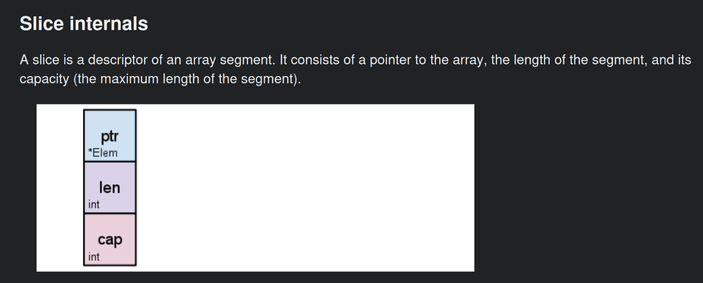

# go-essentials
go quick rampup

# module1 notes
- function overloading is not allowed in go (method overloading is allowed though)
  - implies that i cant have 2 functions with same name and diff return types
- go follows pass by value, i.e, a copy is passed to the function
- go slices and arrays
  - a good detailed overview and usage guide for slices is captured at https://go.dev/blog/slices-intro. Highly recommended reading !!
  - 

## go maps
Ways to initialize the map
(var m map[int] string    <<---- declare the map)

1) Use make. Eg:
   maps1 := make(map[int] string)
   maps1[0] = "stone"

2) Use map literal
   map2 := map[int] string {
    1: "stone",
    2: "gold",
    3: "silver"
   }

   This can also be used to intialize an empty map as well
   map3 := map[int] string {}

# module1 build
- Till the code was organized into folders but was not using go modules (go.mod), simpl 'go build' works - go build -o bin/module1 module1/*.go
- now, with the code organized as go modules, the way to run the code is:
  - navigate to module1
  - go run main.go

# Good references
